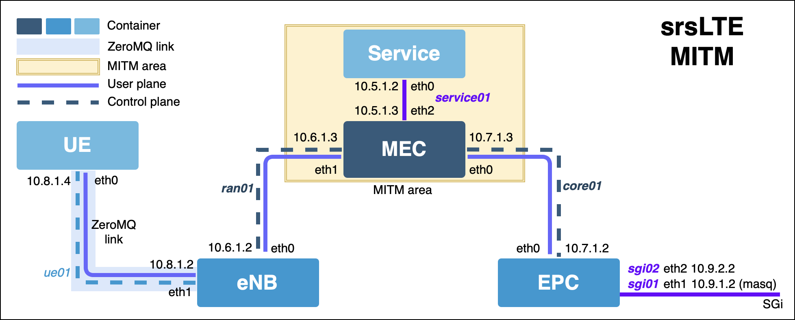

# How to use
```
git clone https://gitlab.com/jed_tw/srslte_mitm  
cd srslte_mitm
```
本專案之 ZeroMQ 功能不需要更改 srsLTE 設定檔案
srsLTE 設定檔預設在 /etc/srslte/ 下, 目前都為預設 

# 先安裝 docker

# 建立架構

```
sudo apt install docker-compose -y
sudo docker-compose up
```

# 分別進入 container 裡
#### MEC
```
sudo docker-compose exec mec /bin/bash
```

#### EPC
```
sudo docker-compose exec srsepc /bin/bash
```

#### ENB
```
sudo docker-compose exec srsenb /bin/bash
```

#### UE
```
sudo docker-compose exec srsue /bin/bash
```

# 開始實驗 with ZeroMQ function (in container)

#### MEC端:
```
# 基本用途
python ~/mec_net_cut.py
# 可以解 s1ap 封包
python ~/mec_net_cut_advanced.py
```

#### EPC 端
```
srsepc --mme.mme_bind_addr 10.7.1.2 --spgw.gtpu_bind_addr 10.7.1.2
```

#### ENB端
```
srsenb --enb.mme_addr=10.7.1.2 --enb.gtp_bind_addr=10.6.1.2 --enb.s1c_bind_addr=10.6.1.2 --rf.device_name=zmq --rf.device_args="fail_on_disconnect=true,tx_port=tcp://*:2000,rx_port=tcp://10.8.1.4:2001,id=enb,base_srate=23.04e6"
```
#### UE 端
```
# 可以用 tmux 新增多分頁來測試
srsue --rf.device_name=zmq --rf.device_args="tx_port=tcp://*:2001,rx_port=tcp://10.8.1.2:2000,id=ue,base_srate=23.04e6"
```
```
# 等連線後，在另一個 tmux 分頁
bash ~/ue_net_set.sh
```

# 暫時離開 Docker compose (會保留資料)
```
在 sudo docker-compose up 視窗按下 Ctrl + c 即可
下次要開再下 sudo docker-compose up
```

# Troubleshooting
# 簡單測試 SCTP 能不能用 (in container)
```
apt install libsctp-dev lksctp-tools -y
```

#### MEC端:
```
python ~/mec_net_cut.py
```

#### EPC端(當 Server)：
```
sctp_darn -H 0 -P 2500 -l
```

#### ENB端(當 Client)：
```
sctp_darn -H 0 -P 2600 -h 10.7.1.2 -p 2500 -s
```

# ZeroMQ Application note
Ref. https://docs.srslte.com/en/latest/app_notes/source/zeromq/source/

# 其他
#### tmux 使用
C-b 指的是 Ctrl + b 同時按  
新增分頁：C-b c  
切換分頁：C-b 數字  
離開tmux：C-b d  

# 危險指令
# 請先確定都了解指令再使用

#### (請確定要這麼做，再下這個指令) 不保留資料，並移除架構
```
sudo docker-compose down
```

####  (請確定要這麼做，再下這個指令) Reset Docker Setting
`sudo docker system prune`

####  (請確定要這麼做，再下這個指令) Delete all containers 
`sudo docker rm -f $(sudo docker ps -a -q)`

####  (請確定要這麼做，再下這個指令) Delete all images 
`sudo docker rmi -f $(sudo docker images -a -q)`
